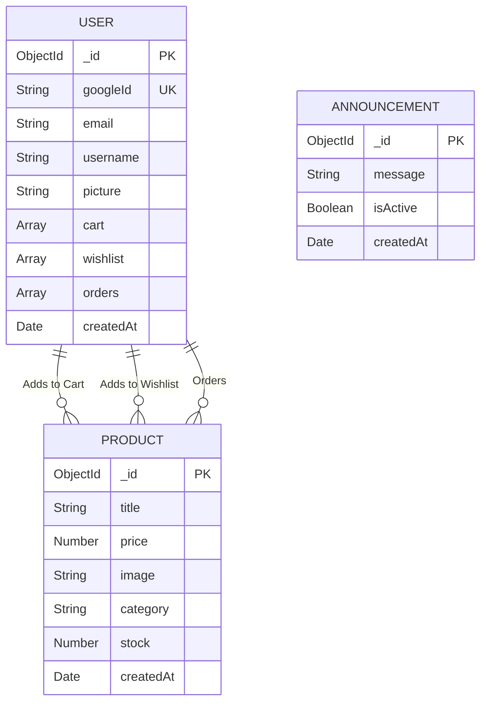

# Archi Fashion - E-Commerce Platform

Archi Fashion is a premium Indian wear e-commerce website. The platform provides a seamless shopping experience for traditional ethnic wear, featuring a modern frontend UI and a robust backend API for managing products, users, orders, and announcements.

## Features

### 🛍️ User Functionalities
* **Authentication:** Secure login using Google Identity Services.
* **Product Catalog:** Browse collections of Sarees, Lehengas, Menswear, and more.
* **Shopping Cart & Wishlist:** Add products to the cart or save them in the wishlist for later.
* **Order Placement:** Seamlessly place orders.
* **User Profile:** View order history, manage wishlist, and view profile details.
* **UI/UX:** Premium design with dark and light mode toggle, skeleton loaders, and responsive layouts.

### ⚙️ Admin Panel Functionalities
* **Dashboard Access:** Secure access restricted to authorized administrators.
* **Product Management:** Add new products (with image uploads), delete products, and easily update stock quantities.
* **Order Management:** View all user orders, customer details, and total order values.
* **Announcements:** Create, toggle active/inactive status, and delete global site announcements.

## Tech Stack
* **Frontend:** Vanilla HTML, CSS, JavaScript
* **Backend:** Node.js, Express.js
* **Database:** MongoDB (Mongoose ODM)
* **Authentication:** Google OAuth

## Entity Relationship Diagram (ERD)

The database consists of three primary collections: `Users`, `Products`, and `Announcements`. The orders and cart data are embedded directly within the user document for faster retrieval in this implementation.



## Running the Project Locally

### Prerequisites
* Node.js installed
* MongoDB connection URI
* Google OAuth Client ID

### Backend Setup
1. Navigate to the `server` directory: `cd server`
2. Install dependencies: `npm install`
3. Create a `.env` file in the `server` directory and add your environment variables:
   ```env
   PORT=5000
   MONGODB_URI=your_mongodb_connection_string
   JWT_SECRET=your_jwt_secret
   ADMIN_EMAILS=comma_separated_admin_emails
   ```
4. Start the server: `npm start` (Runs on http://localhost:5000)

### Frontend Setup
1. Navigate to the `client` directory: `cd client`
2. Ensure you are running a local server to serve the frontend files (e.g., Live Server in VS Code, or `npx serve`).
3. Set your Google Client ID where needed in the HTML files (or via build tool if configured).
4. Open `index.html` in your browser.

## API Endpoints Overview
* **`/api/auth`**: Google authentication, admin verification.
* **`/api/products`**: Fetch, create, update stock, and delete products.
* **`/api/user`**: Fetch profile, update cart, update wishlist, and place orders.
* **`/api/announcements`**: Fetch active announcements, create, toggle status, and delete.
* **`/api/admin/orders`**: Fetch all orders across all users (Admin only).
